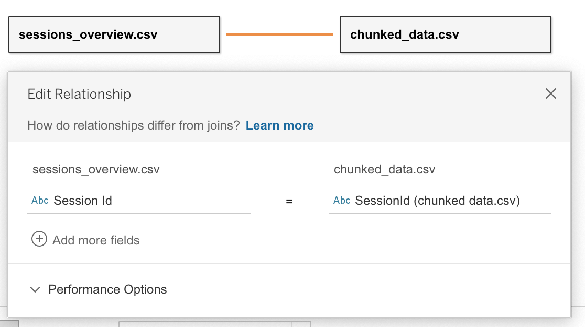

# Panopto Video Analytics
> WIP
> Questions? Reach out to marko.prodanovic@sauder.ubc.ca or alison.myers@sauder.ubc.ca

An interface for getting viewing data from Panopto sessions.

Specify Panopto folders (by folder id) in `courses.csv` to add them to the database. Note that data will be collected for all videos in the specified folder and all subfolders.

There are two independent parts to this project:

<div align="center">
    
</div>

### Updating the Database

- run by calling `$ python update_database.py`
- will grab viewing data from each Panopto folder (and sub-folder within that folder) specified in `courses.csv`
- will add a few additional columns (`Date, StopPosition`) and save data to the database directory
- this part of the project manages its own state so it will only grab data that it doesn't already have, up to the most recent complete UTC date - ie. if it has up to Jan 5 11:59pm UTC and you run it on January 10th at 4pm UTC, it will grab data till Jan 9th 11:59 UTC (the last full date of viewing)
- if a script is being run from the first time the tool will grab all viewing data from Jan 01 2010 (arbitrarty date far back enough to get all viewing data)

⚠️ To delete a folder from the /database folder, remove the folder itself and also its corresponding entry in `./raw_data_handler/state.csv`

### Outputting Chunked Data

- run by calling `$ python output_chunked_data.py`
- this independent part of the project isn't concerned with data on Panopto, but what it already has recorded in the `database` directory
- it will read each folder specified in `courses.csv` from the database and apply transformations and output to a folder with the same title in `output[CHUNKED]`
- it will also create a `output[CHUNKED]/tableau` directory where all data will be concatinated into a single dataset for connecting to Tableau (Note that the folders who's data is get merged together for the final result is what's listed in `courses.csv`)

## Getting Started

### create a `.env` in the project root folder

After cloning the repo create a `.env` that looks like the following (with your credentials instead of the placeholders)

See [here](https://support.panopto.com/s/article/support-panopto-com-s-article-oauth2-client-setup) for info about generating a client id and client secret

```
SERVER = ubc.ca.panopto.com

USERNAME = <panopto-admin-username>
PASSWORD = <panopto-admin-password>

CLIENT_ID = <panopto-api-client-id>
CLIENT_SECRET = <panopto-api-client-secret>
```

> The username and password are used to authenticate with the SOAP API. The client id and secret are used for REST

### Install dependencies using [Anaconda](https://www.anaconda.com/)

Ensure you have anaconda properly [installed](https://docs.anaconda.com/anaconda/install/) using the `conda` command

- `conda --version`
  `-> conda 4.9.2 # example output`

Install the environment using the `environment.yml` file (may take a few minutes)

- `conda env create -f environment.yml`

Activate the environment

- `conda activate panopto-video-analytics`

Fill in `courses.csv` and run the scripts

- `python update_database.py`
- `python output_chunked_data.py`

## Output structure of /database

For each (course) panopto folder specified in courses.csv, `database` will have after running `update_database.py`:

    .
    ├── <Folder Name>[<Folder ID>]
    │   ├── sessions_overview.csv
    │   └── viewing_activity.csv

## Output structure of output[CHUNKED]

For each course in the database, `output[CHUNKED]` will contain the following after running `output_chunked_data.py`:

    .
    ├── <Folder Name>[<Folder ID>]
    │   ├── chunked_data.csv
    │   └── sessions_overview.csv

### What is "Chunked" Data

For each unique viewer, we calculate their total "coverage" of a video representing which parts of the video they're watched. We then divide the timeline up into 20 5% intervals we call "chunks" The chunked output describes viewership in terms of these chunks.

<div align="center">
    
</div>

## Tableau

Perform the following join with the data output by `output_chunked_data.py`:

<div align="center">
    
</div>

## Contributions

**REST interface modified version of modules in:**
[upload-python-sample](https://github.com/Panopto/upload-python-sample)
Contributors (GitHub): Hiroshi Ohno, Zac Rumford
Apache-2.0 License

**SOAP interface modified version of:**
[python-soap](https://github.com/Panopto/python-soap)
Contributors (GitHub): Typer Libey, Gregory Scott Bell, Mark Brewster
Apache-2.0 License
